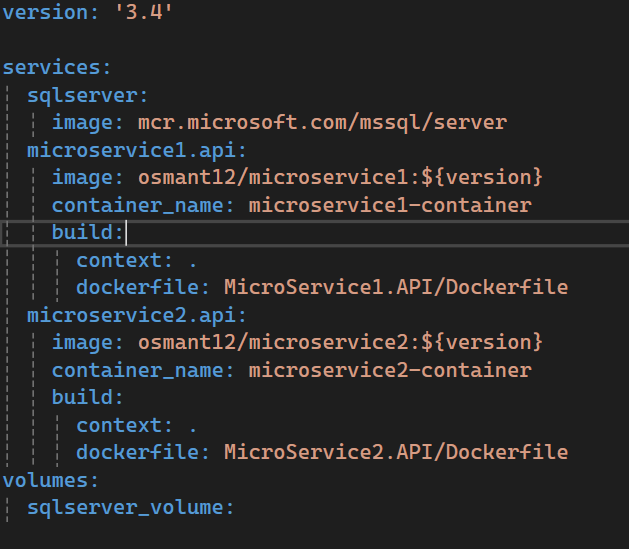
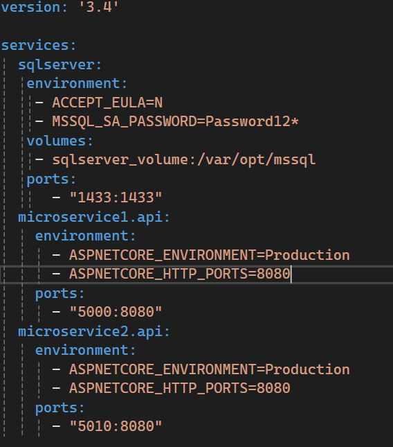
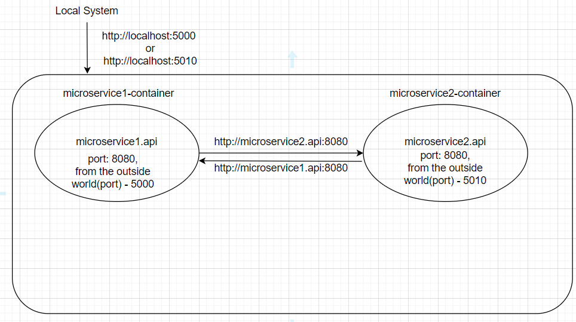

<h1>DockerCompose</h1>
<h3>1. Giriş</h3>

    Gerçekleştirilen dockercompose uygulamasında, birbirlerinden ayrı olarak çalışan birden fazla mikroservis'in yer aldığı containerlar'ın yönetilmesi, birbirleri ile haberleşmesi ele alındı. Bilindiği üzere bilgisayarımızda docker uygulamasından bir container ayağa kaldırıldığı zaman bu container ile localhost üzerinden haberleşme sağlayabiliriz. Ancak bazı durumlarda containerlar'ın birbirleri ile haberleşmesi gerekebilir. Bu durumda localhost artık kullanılamıyor çünkü bu containerlar birbirlerinden bağımsız birer mini işletim sistemleridir aynı işletim sistemi içerisinde yer almıyorlar. Dolayısıyla bu aşamada ayrı containerlar içerisinde yer alan mikroservislerin birbirleri ile haberleşmesinde localhost yerine mikroservislerimize tanımladığımız isimler ve portlar ile haberleşme sağlanıyor. Bahsetmiş olduğum bu kısımla ilgili dockercompose.yml ve docker-compose-override.yml dosyalarına göz atalım:

<b>dockercompose.yml</b>  

<ul>
    <li><b>services:</b> Servislerimizin yer aldığı kısımdır. Containerlar'da ayağa kalkacak servislerin isimleri yer alır. Bu kısımda tanımlanan servis isimleri çok önemlidir. Çünkü servisler birbirleri ile bu servis isimleri aracılığıyla iletişim kuruyor. Birer domain ismi gibi düşünebiliriz. Servis isimlerinin altında imaj ve container isimleri yer alıyor.</li>
    <li><b>build:</b> imaj'ın build edilebilmesi için dockerfile dosyasının arandığı kısımdır. context keyword'ü ile dockercompose'un imaj oluşturmak için arayacağı dockerfile dosyasına referans verilir. Yani dockerfile dosyasının base adresi olarak düşünülebilir. dockerfile keyword'ü ile de context'de belirtilen referans adresi ile bu kısımda belirtilen dockerfile yolu birleştirilerek dockerfile dosyası bulunur.
    </li>
    <li><b>volumes:</b> Services kısmında belirtilen sqlserver servisindeki verilerin kalıcı hale getirilmesi için tanımlanan değerdir. Bu sayede sqlserver servisi'nin ayağa kalktığı container restart edildiğinde veriler kaybolmaz, kalıcı hale gelir. Volume'ler docker içerisinde bulunurlar. İstenirse docker hub'da cloud'da da depolanabilirler.
    </li>
</ul>

<b>docker-compose-override.yml</b>  

dockercompose.yml dosyasında tanımlanan servisler'in portlar'ının tanımlandığı, environment değişkenlerinin yer aldığı, volume'lerin ayarlandığı dosyadır. Bu kısımda port ayarlamalarına dikkat edilmesi gerekir. örneğin, 5000:8080 port eşlemesi yapıldığı zaman, bilgisayarımızdan localhost:5000 port'una bir istek atıldığı zaman docker'da container içerisinde yer alan 8080 port'unda çalışan uygulamamıza yönlenmesi anlamına gelir. Aynı zamanda burada belirtilen 8080 portu, sadece bilgisayarımızdan değil başka containerlar içerisinde çalışan mikroservisler'inde bu port üzerinden bu uygulamaya istek atabileceği anlamına gelir(gizli bir expose yapılmıştır.). 

<h3>2. Şema Gösterimi</h3>

